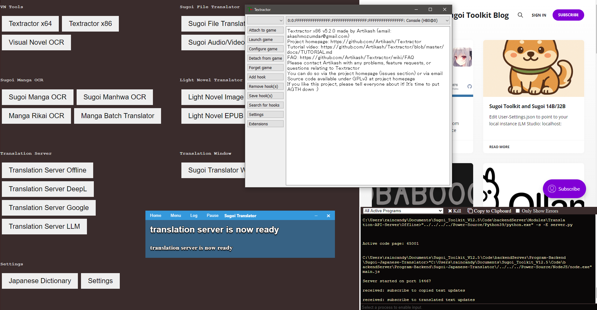
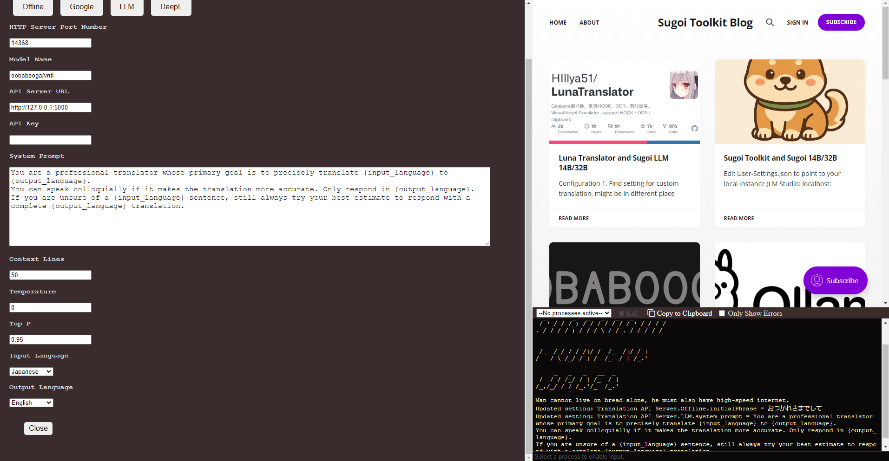
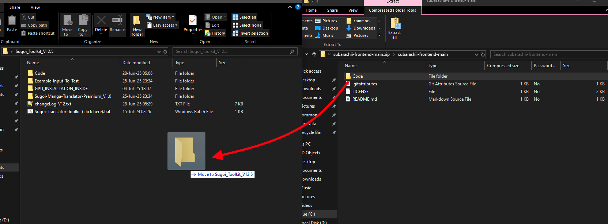

# subarashii-frontend
An alternate front end for Sugoi Toolkit.

Adds an internal console window to consolidate multiple console outputs for a more unified experience.

Also adds a config menu so you don't have to edit the json manually.

To install, download this repository and drag the Code folder into the root folder of Sugoi Toolkit.

